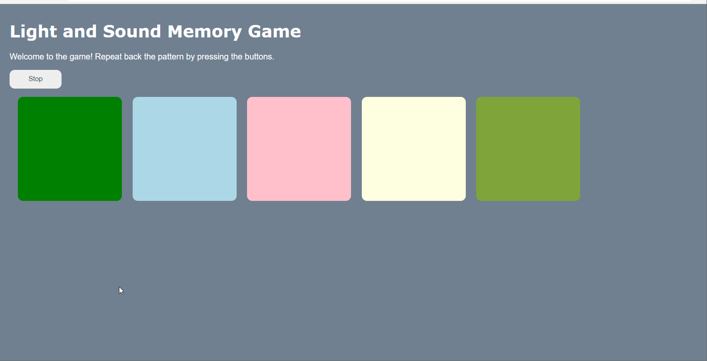
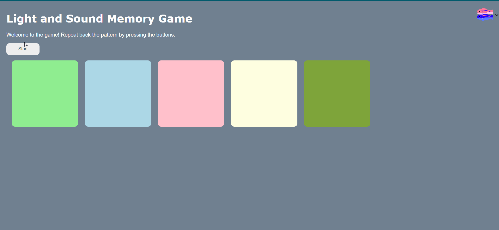

# Pre-work - *Memory Game*

**Memory Game** is a Light & Sound Memory game to apply for CodePath's SITE Program. 

Submitted by: **Lazizbek Ravshanov**

Time spent: **10** hours spent in total

Link to project: https://glitch.com/edit/#!/water-hip-parrot
Live site: https://water-hip-parrot.glitch.me

## Required Functionality

The following **required** functionality is complete:

* [x] Game interface has a heading (h1 tag), a line of body text (p tag), and four buttons that match the demo app
* [x] "Start" button toggles between "Start" and "Stop" when clicked. 
* [x] Game buttons each light up and play a sound when clicked. 
* [x] Computer plays back sequence of clues including sound and visual cue for each button
* [x] Play progresses to the next turn (the user gets the next step in the pattern) after a correct guess. 
* [x] User wins the game after guessing a complete pattern
* [x] User loses the game after an incorrect guess

The following **optional** features are implemented:

* [x] Any HTML page elements (including game buttons) has been styled differently than in the tutorial
* [ ] Buttons use a pitch (frequency) other than the ones in the tutorial
* [x] More than 4 functional game buttons
* [ ] Playback speeds up on each turn
* [x] Computer picks a different pattern each time the game is played
* [ ] Player only loses after 3 mistakes (instead of on the first mistake)
* [ ] Game button appearance change goes beyond color (e.g. add an image)
* [ ] Game button sound is more complex than a single tone (e.g. an audio file, a chord, a sequence of multiple tones)
* [ ] User has a limited amount of time to enter their guess on each turn

The following **additional** features are implemented:

- [ ] List anything else that you can get done to improve the app!

## Video Walkthrough (GIF)

Lose game

Win game

## Reflection Questions
1. If you used any outside resources to help complete your submission (websites, books, people, etc) list them here. 

Even though I had solid background of HTML, CSS and JS, I used some websites that helped me a lot, one of them being w3schools. 
Apart from that, I used Mozilla Developer Browser to look through some JS syntax as a refresher.

2. What was a challenge you encountered in creating this submission (be specific)? How did you overcome it? (recommended 200 - 400 words) 
The challenge was to do the logic of the game after I added a new button at the end. It took me sleepless night to find the bug, which was hindering the last button to work when the game started. 

3. What questions about web development do you have after completing your submission? (recommended 100 - 300 words) 
After doing this small project, I came to realize how painful it is to develop multi-functional websites, which operate in different spheres like online banking, online shopping and many more. I have been even more interested in developing the websites since this little project made me learn a lot. Plus, I would be more into debugging the code, testing it with different scenarios.

4. If you had a few more hours to work on this project, what would you spend them doing (for example: refactoring certain functions, adding additional features, etc). Be specific. (recommended 100 - 300 words) 
There are a bunch of customizations to be done on this project yet. One of them I would add is the background image for the buttons once they are clicked. Other functionality can be the timer. I would also add the button at which a user chooses the difficulty level, from 4 to 10 patterns maybe. 

## Interview Recording URL Link

[My 5-minute Interview Recording](your-link-here)

## License

    Copyright [YOUR NAME]

    Licensed under the Apache License, Version 2.0 (the "License");
    you may not use this file except in compliance with the License.
    You may obtain a copy of the License at

        http://www.apache.org/licenses/LICENSE-2.0

    Unless required by applicable law or agreed to in writing, software
    distributed under the License is distributed on an "AS IS" BASIS,
    WITHOUT WARRANTIES OR CONDITIONS OF ANY KIND, either express or implied.
    See the License for the specific language governing permissions and
    limitations under the License.
